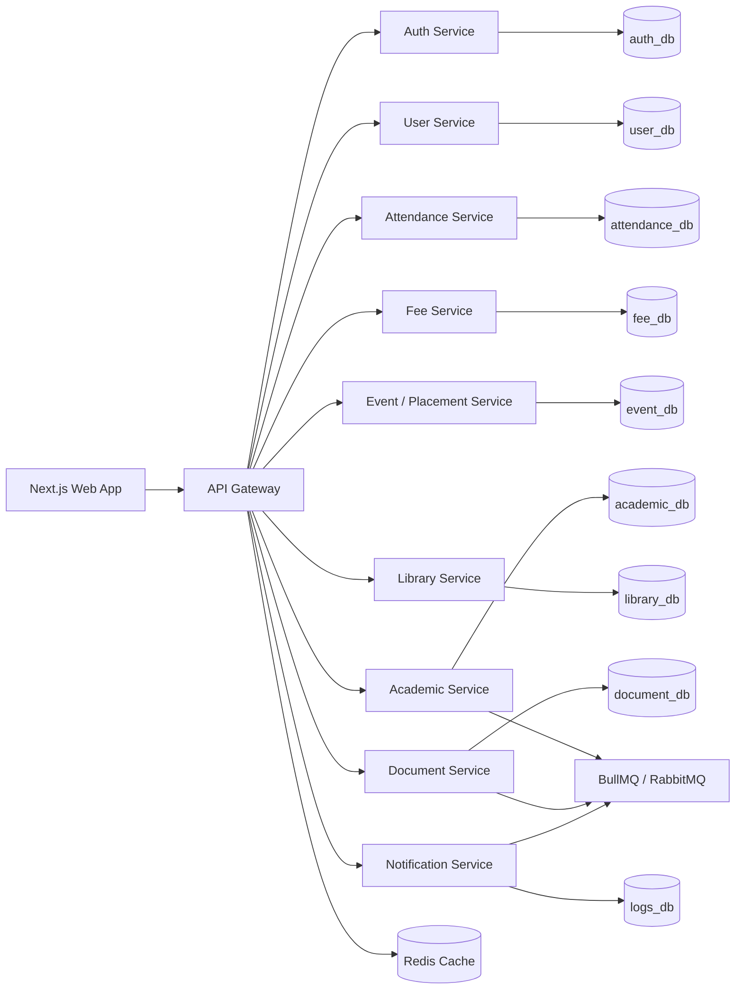

# CampusFlow - Advanced College ERP System


**CampusFlow** is a scalable, AI-powered College ERP platform designed for modern institutions that need secure, high-performance management of academic, administrative, financial, placement, library, and communication workflows.

> CampusFlow - Scalable AI-Powered College ERP Platform for 12,000+ users.

## Project Overview

CampusFlow is built as an enterprise-grade ERP system for colleges and universities. It is designed to manage 12,000+ users across multiple operational roles while keeping data ownership, performance, security, and future scalability in focus.

Supported role groups:

- Students
- Faculty
- HOD
- Admin Office
- CDC / Placement Cell
- Fee Department
- Exam Cell
- Library
- Super Admin

The platform follows a TypeScript monorepo and microservices architecture with a Next.js frontend, Node.js/Express backend services, PostgreSQL databases, Prisma ORM, Redis caching, queue-based background processing, and production-focused deployment paths.

## Key Features

| Module | Capabilities |
| --- | --- |
| Student Management | Profiles, admission records, enrollment, documents, TC requests |
| Faculty Management | Faculty profiles, attendance workflows, assignments, reports |
| Attendance Management | Attendance marking, analytics, percentage calculation, reports |
| Fee Management | Fee structures, installments, payments, receipts, pending dues |
| Exam Management | Exam forms, timetables, admit cards, marks, results, backlogs |
| Placement Management | Companies, placement drives, applications, rounds, offer tracking |
| Library Management | Book inventory, issue/return, fines, availability search |
| Notifications | Email, SMS, push, in-app alerts, announcements |
| Reports & Analytics | PDF/Excel exports, dashboard charts, operational analytics |
| RBAC | Role-based access control with permission-based navigation |
| Audit Logs | Activity tracking, login logs, system-level audit trail |
| Real-Time Updates | Socket.IO-ready notifications and dashboard events |
| File Management | Secure uploads, document verification, certificate generation |
| Payment Integration | Online payment gateway-ready fee workflow |
| Dashboard Analytics | Role-specific KPI cards, charts, and summaries |

## Tech Stack

### Frontend

- Next.js / React
- TypeScript
- Tailwind CSS
- Redux Toolkit
- TanStack Query / React Query
- React Hook Form
- Zod
- Recharts
- Framer Motion

### Backend

- Node.js
- Express.js
- TypeScript
- JWT authentication
- Refresh tokens
- bcrypt password hashing
- Prisma ORM
- Multer
- Winston Logger
- Helmet, CORS, Rate Limiting

### Database

- PostgreSQL
- Prisma ORM
- Service-owned schemas/databases
- Indexed large tables
- Soft delete and audit columns

### Performance

- Redis caching
- BullMQ / RabbitMQ-ready queues
- Server-side pagination
- Background jobs for notifications, reports, imports, and exports

### DevOps

- Docker
- Nginx
- PM2
- Health checks
- Centralized logging

### Deployment

- Frontend: Vercel
- Backend: VPS / Railway / Render
- Database: Managed PostgreSQL such as Neon
- Redis: Managed Redis such as Upstash

## System Architecture

CampusFlow uses a microservices architecture where each domain owns its data and exposes APIs through the API Gateway. Cross-service references use stable IDs such as `studentId`, `facultyId`, and `userId` instead of cross-database foreign keys.



If an architecture image is added later, place it under `docs/assets/architecture.png` and embed it here:

```md

```

## Module Overview

### Student ERP

- Profile management
- Attendance view
- Fee status and online payment
- Exam forms and results
- Assignment upload
- Document workspace
- Placement and internship applications
- Transfer certificate application
- Notifications

### Faculty ERP

- Attendance marking
- Student lists
- Assignment creation
- Marks upload
- Timetable
- Leave management
- Document verification
- Reports

### HOD ERP

- Department dashboard
- Faculty monitoring
- Student performance analytics
- Attendance reports
- Subject allocation
- Approval workflows
- Department notices

### Admin ERP

- Student admission records
- Enrollment management
- Document verification
- Bonafide certificates
- TC certificates
- ID card generation
- Reports

### CDC ERP

- Company registration
- Placement drive creation
- Eligibility filters
- Student applications
- Application status updates
- Interview rounds
- Offer letter tracking
- Placement analytics

### Fee ERP

- Fee structure management
- Installments
- Payment records
- Pending dues
- Receipt generation
- Payment gateway integration
- Fee analytics

### Exam ERP

- Exam timetable
- Admit card generation
- Internal marks
- Result upload
- Semester-wise performance
- Backlog tracking

### Library ERP

- Book inventory
- Issue and return workflow
- Fine calculation
- Student library history
- Book availability search

### Super Admin ERP

- College and department management
- User role and permission management
- Academic year/session management
- Global dashboard analytics
- System settings
- Audit logs

## Performance & Scalability

CampusFlow is being designed to support 12,000+ users and high-volume institutional data.

- Optimized PostgreSQL indexing for large records
- Service-owned databases for scalable domain boundaries
- Redis caching for high-read workloads
- Server-side pagination, search, filtering, and sorting
- Queue-based notification and report processing
- Background jobs for email, PDF, Excel, and bulk imports
- No full-table loading on frontend lists
- Dashboard APIs designed for cached aggregates

Performance targets:

- API response under 500ms for paginated records
- Dashboard load under 3 seconds
- Page load under 2 seconds
- Bulk import of 1,000+ records safely

## Security Features

- JWT access tokens
- Refresh token flow
- bcrypt password hashing
- Role-based permissions
- Permission-based sidebar and protected routes
- Rate limiting
- Helmet security headers
- CORS controls
- Zod request validation
- SQL injection protection through Prisma ORM
- Secure file upload rules
- Login logs and audit logs

## Installation Guide

### 1. Clone Repository

```bash
git clone <repository-url>
cd CampusFlow
```

### 2. Install Dependencies

```bash
npm install
```

If using pnpm:

```bash
pnpm install
```

### 3. Configure Environment

```bash
cp .env.example .env
```

Update database URLs, JWT secrets, Redis URL, queue configuration, payment keys, and notification provider credentials.

### 4. Run Database Migrations

```bash
npm run db:migrate
```

Or with pnpm:

```bash
pnpm db:migrate
```

### 5. Seed Data

```bash
npm run db:seed
```

Seed plans include:

- 500 students
- 50 faculty
- 10 departments
- 20 subjects
- 1,000 attendance records
- 1,000 fee records
- role and permission records

### 6. Run Frontend

```bash
npm run dev --workspace=@campusflow/web
```

### 7. Run Backend Services

```bash
npm run dev --workspace=@campusflow/api-gateway
npm run dev --workspace=@campusflow/auth-service
npm run dev --workspace=@campusflow/user-service
```

Additional services can be started the same way by workspace name.

## Environment Variables

See [.env.example](.env.example) for the full environment template.

Important groups:

```env
NODE_ENV=development
FRONTEND_URL=http://localhost:3000
API_GATEWAY_PORT=4000
JWT_ACCESS_SECRET=replace-with-strong-access-secret
JWT_REFRESH_SECRET=replace-with-strong-refresh-secret
AUTH_DATABASE_URL=postgresql://...
USER_DATABASE_URL=postgresql://...
REDIS_URL=redis://localhost:6379
BULLMQ_PREFIX=campusflow
PAYMENT_PROVIDER=razorpay
UPLOAD_MAX_FILE_SIZE_MB=20
```

## API Documentation

API documentation will live under [docs/api](docs/api).

Planned endpoint groups:

- `POST /auth/login`
- `POST /auth/refresh`
- `GET /users`
- `GET /students`
- `GET /faculty`
- `GET /attendance`
- `GET /fees`
- `POST /payments`
- `GET /placements`
- `GET /notifications`
- `GET /reports`
- `GET /audit-logs`
- `GET /health`

Large list APIs must support:

```txt
?page=1&limit=20&search=&sortBy=createdAt&order=desc
```

## Project Folder Structure

```txt
apps/
  web/                     Next.js 14 frontend
services/
  api-gateway/             Routing, auth middleware, rate limiting
  auth-service/            Identity, login, tokens, password reset
  user-service/            Profiles, RBAC, departments, settings
  attendance-service/      Attendance capture, analytics, reports
  fee-service/             Fee plans, invoices, payments, receipts
  event-service/           Events, placements, applications, offers
  notification-service/    Email, SMS, push, audit logs
  academic-service/        Exams, results, timetable, assignments, leave
  library-service/         Books, issues, returns, fines
  document-service/        Uploads, verification, certificates, exports
packages/
  config/                  Shared config constants
  contracts/               Shared TypeScript contracts
  logger/                  Shared logging helpers
infra/
  docker/                  Docker setup
  prisma/                  Database strategy and schema notes
  k8s/                     Future Kubernetes manifests
docs/
  api/                     API documentation
  deployment/              Deployment guides
```

## Database Strategy

Each microservice owns its database and Prisma schema:

- `auth_db`
- `user_db`
- `attendance_db`
- `fee_db`
- `event_db`
- `logs_db`
- `academic_db`
- `library_db`
- `document_db`

Cross-service references use stable IDs such as `studentId`, `facultyId`, and `userId`.

## Screenshots

Dashboard screenshot placeholders:

| Student Dashboard | Admin Dashboard |
| --- | --- |
| `docs/assets/screenshots/student-dashboard.png` | `docs/assets/screenshots/admin-dashboard.png` |

| Placement Dashboard | Fee Dashboard |
| --- | --- |
| `docs/assets/screenshots/placement-dashboard.png` | `docs/assets/screenshots/fee-dashboard.png` |

## Deployment Guide

### Frontend

- Deploy `apps/web` to Vercel.
- Configure `NEXT_PUBLIC_API_BASE_URL`.
- Enable production build checks.

### Backend

- Deploy services to VPS, Railway, Render, or container platform.
- Run services behind Nginx or a managed load balancer.
- Use PM2 or container orchestration for process management.
- Expose only the API Gateway publicly.

### Database

- Use managed PostgreSQL such as Neon.
- Enable automated backups.
- Use connection pooling.
- Run migrations during controlled deployment windows.

### Redis

- Use managed Redis such as Upstash.
- Use Redis for cache, queues, rate limiting, and notification workflows.

## Current Phase

Phase 1 and Phase 2 are scaffolded:

- Monorepo workspace structure
- Service boundaries for API Gateway, Auth, User, Attendance, Fee, Event, Notification, Academic, Library, and Document services
- Service-specific Prisma schemas for separate PostgreSQL databases
- Shared packages for contracts, config, and logging
- Initial infrastructure folders for Docker, Kubernetes, and deployment docs
- 12,000-user scalability baseline documented in [docs/scalability-analysis.md](docs/scalability-analysis.md)

## Planned Phases

1. Project folder structure
2. Database schema and indexing
3. RBAC and permissions
4. API Gateway and service APIs
5. Server-side pagination/search/filter/sort
6. Redis caching and queue system
7. Bulk import/export
8. Frontend dashboards and virtualized tables
9. Reporting system
10. Monitoring, logging, and health checks
11. Load testing
12. Production deployment

## Future Enhancements

- AI chatbot for student and admin support
- Predictive analytics for attendance, fees, and placement outcomes
- Mobile app for students and faculty
- Multi-college SaaS mode
- Advanced BI dashboards
- Automated timetable generation
- AI-assisted document verification

## Contributor

**Piyush Mishra**
